# CG Homework6

## 实现 Phong 光照模型

按照之前的实验，首先在场景中绘制一个cube

由于我们需要实现光照模型，因此还需要额外绘制一个光源，颜色默认为白色

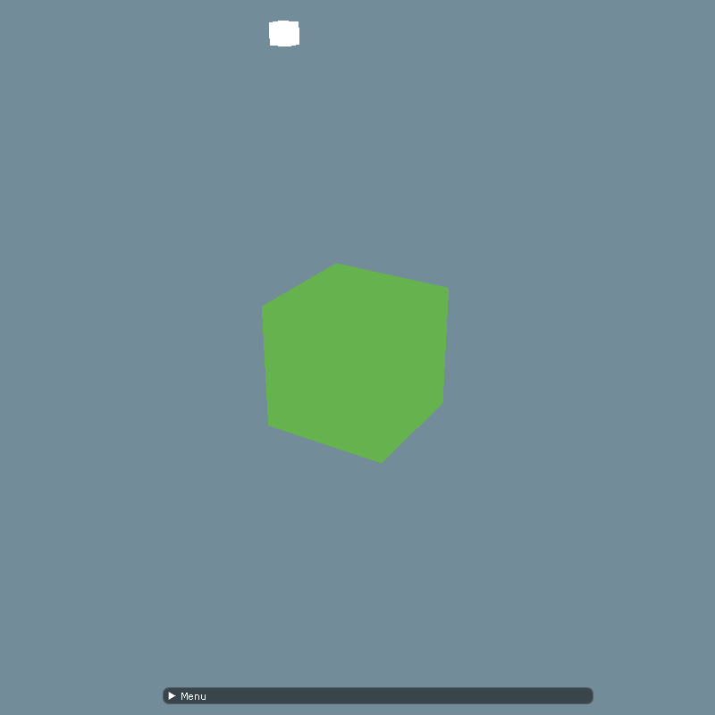

立方体具体的绘制过程在前几次实验已经做过很多次了，这里就不再详细描述了。


根据 `Phong` 光照模型，物体的颜色是由环境光、漫反射以及镜面反射组成的。

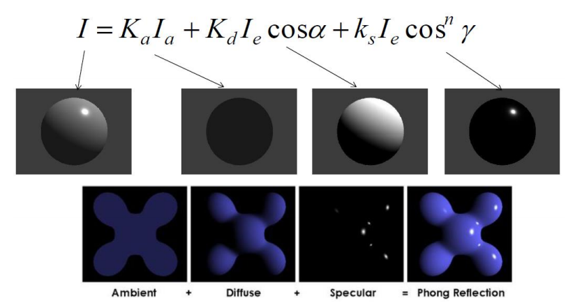

这里首先来实现环境光和漫反射。

### 环境光

环境光的实现比较简单，只需要在片段着色器将当前立方体的颜色乘上光照颜色，就可以实现环境光。但是这样会显得很亮，因此我们还需要为其加上一个权值。

```c
#version 450 core
out vec4 FragColor;

uniform vec3 objectColor; // 物体颜色
uniform vec3 lightColor; // 光照颜色

uniform float ambientStrength; // 环境光强度

void main() {
	vec3 ambient = ambientStrength * lightColor;
	vec3 result = ambient * objectColor;
  FragColor = vec4(result, 1.0);
}
```

然后在渲染过程中传入以上参数

```c++
cubeShader->SetVec3("objectColor", 0.4f, 0.7f, 0.3f); // 物体颜色
cubeShader->SetVec3("lightColor", 1.0f, 1.0f, 1.0f); // 光照颜色
cubeShader->SetFloat("ambientStrength", this->ambientStrength); // 环境光强度
```

调节环境光强度，可以看到以下效果

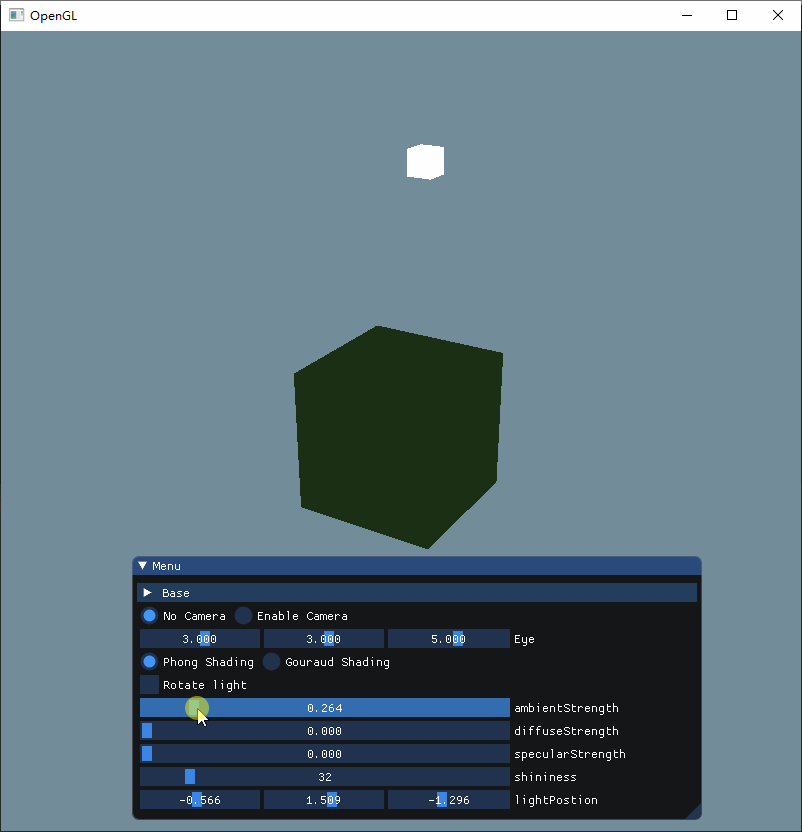

### 漫反射

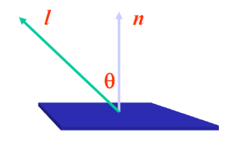

光源照射到立方体的面上，如果光源直射于面，那么就会产生更大的亮度，反之，如果光源侧着射向这个面，那么光源对于这个面的亮度影响就会很小。通过计算光源到点的连线于这个点所在面的法向量之间的夹角，就可以知道这个光源对于这个点的漫反射的影响的亮度有多少。

要实现漫反射，需要用到立方体每个面的法向量，这里为了方便起见，直接把法向量放在顶点组中，传递给顶点着色器，然后再传给片段着色器。只需要告诉着色器顶点的解析方式即可。

```c++
glVertexAttribPointer(0, 3, GL_FLOAT, GL_FALSE, 6 * sizeof(float), (void*)0);
glEnableVertexAttribArray(0);
glVertexAttribPointer(1, 3, GL_FLOAT, GL_FALSE, 6 * sizeof(float), (void*)(3*sizeof(float)));
glEnableVertexAttribArray(1);
```

漫反射的计算的时候，还需要知道顶点的具体位置，这些信息在顶点着色器一同传递过去

```c
#version 450 core
layout (location = 0) in vec3 aPos;
layout (location = 1) in vec3 aNormal;

uniform mat4 model;
uniform mat4 view;
uniform mat4 projection;

out vec3 Normal;
out vec3 FragPos;

void main() {
	gl_Position = projection * view * model * vec4(aPos, 1.0f);
	FragPos = vec3(model * vec4(aPos, 1.0)); // 片段所在位置
	Normal = mat3(transpose(inverse(model))) * aNormal; // 顶点所在面的法向量
}
```

顶点的位置只需要将顶点做一个`model`变换就可以得到。

为了防止非等比缩放对于法向量带来的影响，这里将`model`取逆再做一个转置得到`法线矩阵`，然后对法向量进行变换，移除了对法向量错误缩放的影响。

现在，我们得到了顶点位置以及法向量，还需要光源的位置就可以计算漫反射了。这个可以通过`uniform`直接传入片段着色器中。

漫反射的强度可以表示为以下的公式：

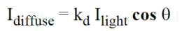

在计算过程中，我们首先要对其进行标准化。

其中$k_d$为漫反射的系数，下面用`diffuseStrength`表示，$I_{light}$为入射光线强度，$cos\theta$ 为入射关系和法向量之间的夹角，也可以表示为：

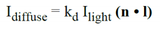

其中$n$就是法向量，而$l$是光线向量，通过 $光线位置向量 - 片段位置向量$ 可以计算出来，当结果小于0时取0.

具体的代码如下：

```c
#version 450 core
out vec4 FragColor;

uniform vec3 objectColor;
uniform vec3 lightColor;

uniform vec3 lightPos;

uniform float ambientStrength;
uniform float diffuseStrength;

in vec3 Normal;
in vec3 FragPos;

void main() {
	vec3 ambient = ambientStrength * lightColor; // 环境光

	vec3 norm = normalize(Normal); // 法向量
	vec3 lightDir = normalize(lightPos - FragPos); // 光线向量
  
	float diff = max(dot(norm, lightDir), 0.0);
	vec3 diffuse = diffuseStrength * diff * lightColor; // 漫反射
  
	vec3 result = (ambient + diffuse) * objectColor;
  FragColor = vec4(result, 1.0);
}
```

调节不同的漫反射强度：

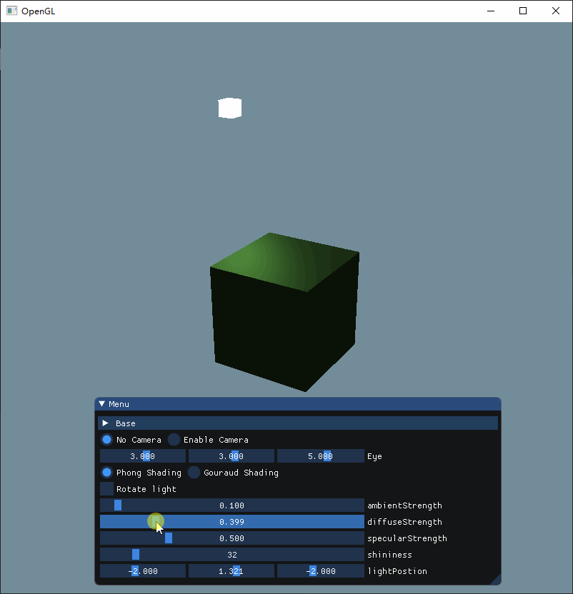

为了方便观察，这里使光源旋转起来（下面再详述具体操作）可以观察到，在光源和面呈现不同的角度的时候，其亮度也在发生变化，当光源垂直于面时，其亮度最高。

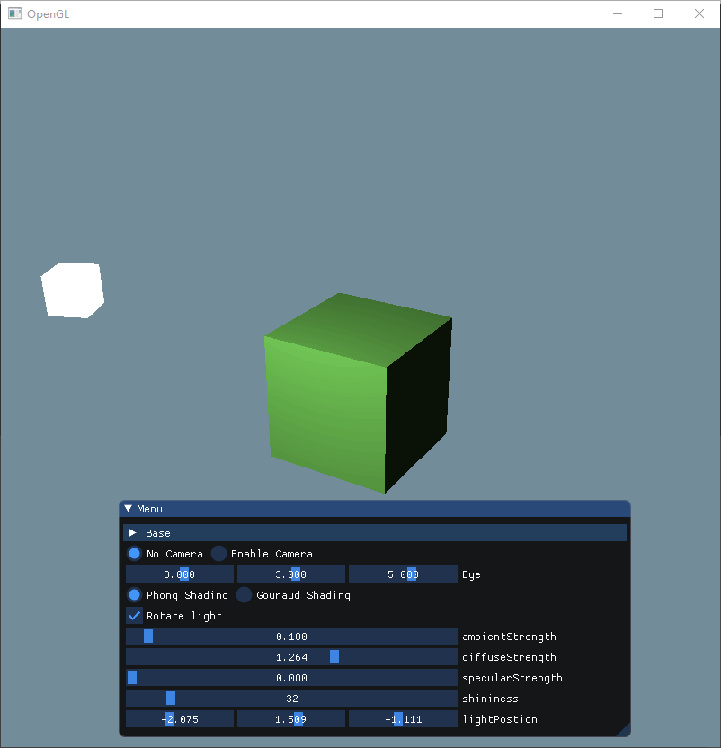

### 镜面反射

镜面反射需要根据观察的位置进行渲染

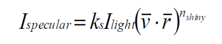

其中$v$为点到视角的向量，$r$为反射方向的向量，$n_{shiny}$为物体材质的反射率

片段到视角的向量可以通过 $视角向量 - 片段向量$ 计算 `vec3 viewDir = normalize(viewPos - FragPos);`

反射方向则直接使用`reflect`函数，输入从光源指向片段的向量以及法向量得到`	vec3 reflectDir = reflect(-lightDir, norm);`

然后再将两者点乘，然后以反射率为幂方，最后乘上强度因子和光线颜色，得到最终的镜面反射

然后将环境光、漫反射、镜面反射三者加在一起，成为冯氏光照模型：

```c
void main() {
	vec3 ambient = ambientStrength * lightColor;

	vec3 norm = normalize(Normal);
	vec3 lightDir = normalize(lightPos - FragPos);

	float diff = max(dot(norm, lightDir), 0.0);
	vec3 diffuse = diffuseStrength * diff * lightColor;

	vec3 viewDir = normalize(viewPos - FragPos);
	vec3 reflectDir = reflect(-lightDir, norm);
	float spec = pow(max(dot(viewDir, reflectDir), 0.0), shininess);
	vec3 specular = specularStrength * spec * lightColor;

	vec3 result = (ambient + diffuse + specular) * objectColor;
   FragColor = vec4(result, 1.0);
}
```

调节镜面反射强度：

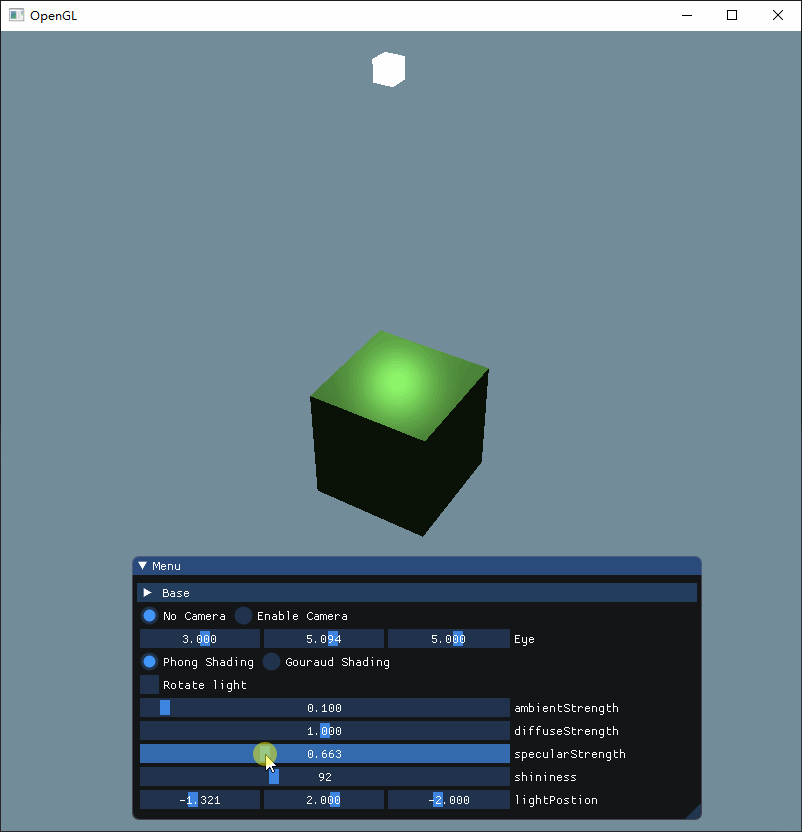

调节反射率：

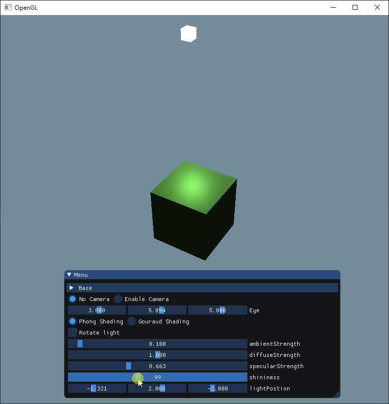

可以看到，反射率越高，其光晕就越明显。


最终加上所有效果：

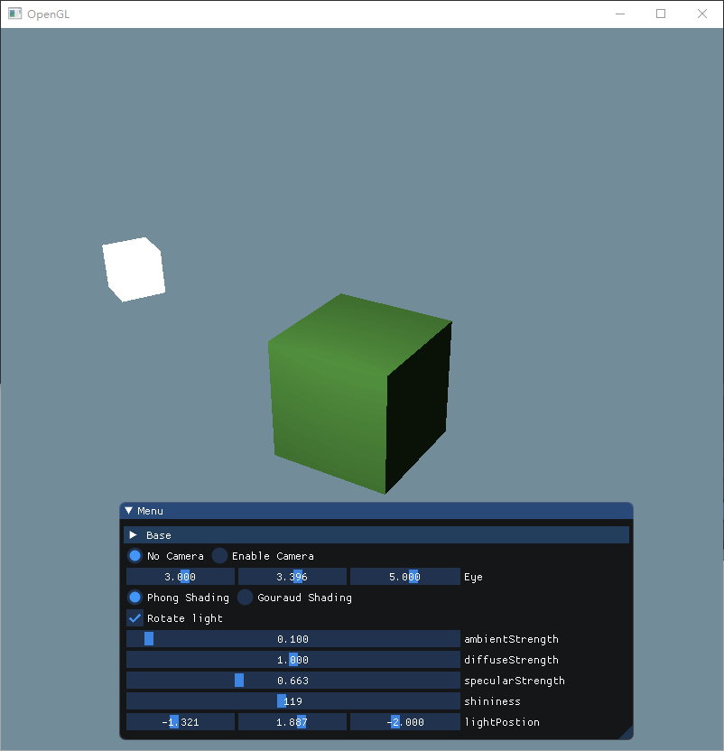


## 实现 Gouraud 光照模型

`Gouraud`模型和`Phong`模型的区别就在于其光照的计算是在顶点着色器还是片段着色器中实现，因此，在实现了`Phong`模型的基础上，改成`Gouraud`实在是很简单，只需要把计算光照的代码从片段着色器中移动到顶点着色器就可以了

```c
#version 450 core
layout (location = 0) in vec3 aPos;
layout (location = 1) in vec3 aNormal;

uniform mat4 model;
uniform mat4 view;
uniform mat4 projection;

uniform vec3 lightColor;
uniform vec3 lightPos;
uniform vec3 viewPos;

uniform float ambientStrength;
uniform float diffuseStrength;
uniform float specularStrength;
uniform int shininess;

out vec3 outColor;

void main() {
	gl_Position = projection * view * model * vec4(aPos, 1.0f);

	vec3 FragPos = vec3(model * vec4(aPos, 1.0));
	vec3 Normal = mat3(transpose(inverse(model))) * aNormal;

	vec3 ambient = ambientStrength * lightColor;

	vec3 norm = normalize(Normal);
	vec3 lightDir = normalize(lightPos - FragPos);
	float diff = max(dot(norm, lightDir), 0.0);
	vec3 diffuse = diffuseStrength * diff * lightColor;

	vec3 viewDir = normalize(viewPos - FragPos);
	vec3 reflectDir = reflect(-lightDir, norm);
	float spec = pow(max(dot(viewDir, reflectDir), 0.0), shininess);
	vec3 specular = specularStrength * spec * lightColor;

	outColor = ambient + diffuse + specular;
}
```

在片段着色器中，只需要计算最终的颜色

```c
#version 450 core
out vec4 FragColor;


in vec3 outColor;

uniform vec3 objectColor;

void main() {
    FragColor = vec4(outColor * objectColor, 1.0);
}
```

这样看上去好像和冯氏光照没什么区别，同样都是这些参数，同样都是这些计算。但是`Gouraud`模型中，仅需要计算顶点的光照，而片段的光照通过插值实现，这样一来，计算的开销就会小很多，但是在顶点比较少的情况下，会显得有些奇怪。

虽然在大多数情况下看不出这两种模型有什么区别，但是在某些特殊的视角就可以看出不同的效果。

| Phong 模型                                       | Gouraud 模型                                     |
| ------------------------------------------------ | ------------------------------------------------ |
| 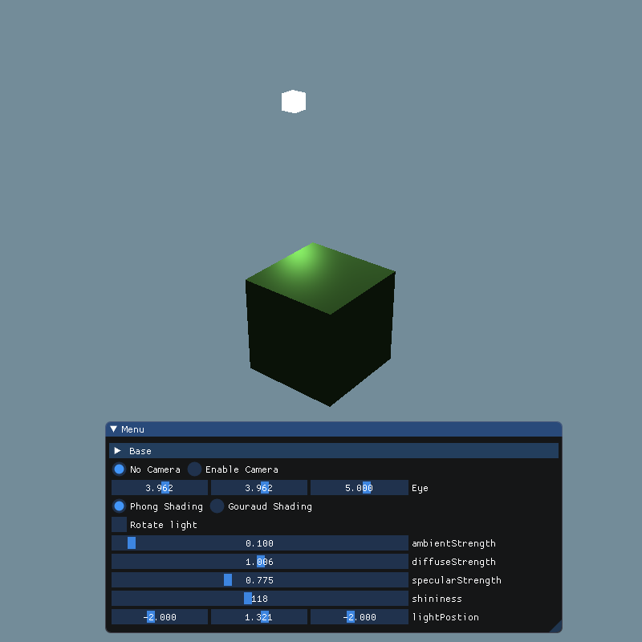 | 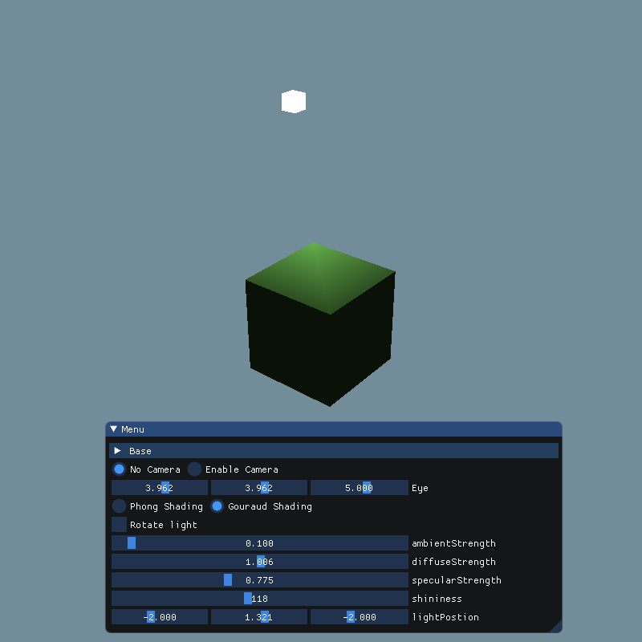 |

上面是同一个位置的两种模型的同一位置同一参数的结果。

可以看到，由于`Gouraud`模型只计算了顶点的光照，片段是通过顶点的插值渲染的，当镜面反射出现在点上的时候，就显得很奇怪，只有一个点出现了镜面反射，因此这一点特别亮，然后呈放射状向其他点扩散。而显示不出光晕的效果。

旋转起来就更加奇怪了

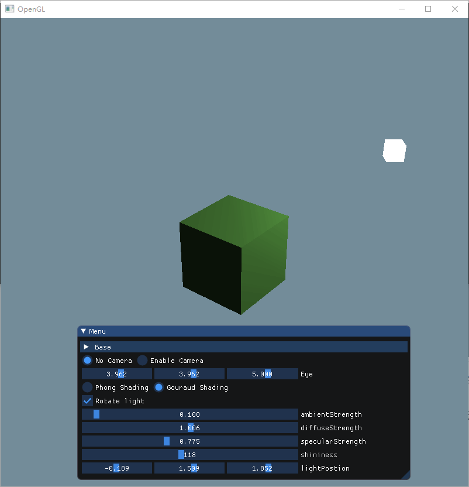


## 使光源动起来

这个实现起来也不难，只需要给光源的model一个变换即可。

需要注意的是，在设置立方体的光照的时候，需要先计算光源的位置变换的`model`，然后给一个单位位置添加上这个变换再传递给光照的着色器。

```c++
projection = glm::perspective(glm::radians(zoom), 1.0f, 0.1f, 100.0f);

cubeShader->SetMat4("model", model);
cubeShader->SetMat4("view", view);
cubeShader->SetMat4("projection", projection);

cubeShader->SetVec3("objectColor", 0.4f, 0.7f, 0.3f); // 物体颜色
cubeShader->SetVec3("lightColor", 1.0f, 1.0f, 1.0f); // 光照颜色
cubeShader->SetFloat("ambientStrength", this->ambientStrength); // 环境光强度
cubeShader->SetFloat("specularStrength", this->specularStrength); // 镜面强度
cubeShader->SetFloat("diffuseStrength", this->diffuseStrength); // 漫反射强度
cubeShader->SetInt("shininess", this->shininess); // 反光度

model = glm::mat4(1.0f);
// 旋转光源
if (rotateLight) {
  model = glm::rotate(model, (float)glfwGetTime(), glm::vec3(0.0f, 1.0f, 0.0f));
}
model = glm::translate(model, lightPos);
model = glm::scale(model, glm::vec3(0.2f));

glm::vec4 location = model * glm::vec4(1.0f);

cubeShader->SetVec3("lightPos", location.x, location.y, location.z); // 光照位置

glBindVertexArray(VAO);
glDrawElements(GL_TRIANGLES, 36, GL_UNSIGNED_INT, 0);

// 光照
lightingShader->Use();
lightingShader->SetMat4("model", model);
lightingShader->SetMat4("view", view);
lightingShader->SetMat4("projection", projection);

glBindVertexArray(lightVAO);
glDrawElements(GL_TRIANGLES, 36, GL_UNSIGNED_INT, 0);
```

结合旋转和上次实现的摄像机模型，可以实现以下效果：

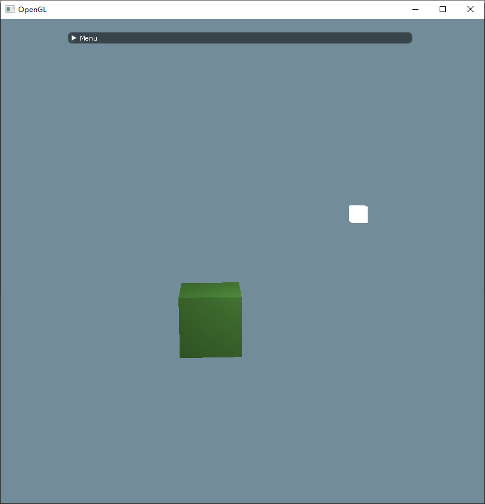