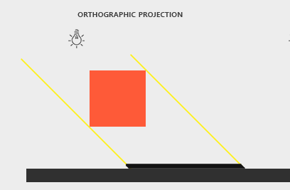

# Shadowing Mapping

## 实现Shadowing Mapping

这次实验需要实现光照下的阴影渲染，因此首先需要一个可以显示阴影的场景。这里在之前的立方体的基础上添加了一块地板来显示立方体的阴影。

地板本质上同样是一个立方体，只需要将其向下平移并且打扁即可。

```c++
glm::mat4  model = glm::mat4(1.0f);
model = glm::translate(model, glm::vec3(0.0f, -0.5f, 0.0f)); // 向下平移
model = glm::scale(model, glm::vec3(10.0f, 0.1f, 10.0f)); // 打扁
shader.SetMat4("model", model);
glBindVertexArray(VAO);
glDrawElements(GL_TRIANGLES, 36, GL_UNSIGNED_INT, 0);
```

我们切换到自由视角观察，可以发现，无论从哪个角度观察，都不存在阴影


接下来，就来实现阴影。

阴影渲染有两大基本步骤

首先，**以光源视角渲染场景，得到深度图**(DepthMap)，并存储为texture

在此之前，我们需要先初始化深度图，创建阴影纹理

```c++
// 阴影 创建2D纹理
glGenFramebuffers(1, &depthMapFBO);
glGenTextures(1, &depthMap);
glBindTexture(GL_TEXTURE_2D, depthMap);
glTexImage2D(GL_TEXTURE_2D, 0, GL_DEPTH_COMPONENT, SHADOW_WIDTH, SHADOW_HEIGHT, 0, GL_DEPTH_COMPONENT, GL_FLOAT, NULL);
glTexParameteri(GL_TEXTURE_2D, GL_TEXTURE_MIN_FILTER, GL_NEAREST);
glTexParameteri(GL_TEXTURE_2D, GL_TEXTURE_MAG_FILTER, GL_NEAREST);
glTexParameteri(GL_TEXTURE_2D, GL_TEXTURE_WRAP_S, GL_REPEAT);
glTexParameteri(GL_TEXTURE_2D, GL_TEXTURE_WRAP_T, GL_REPEAT);
// 绑定深度缓冲
glBindFramebuffer(GL_FRAMEBUFFER, depthMapFBO);
glFramebufferTexture2D(GL_FRAMEBUFFER, GL_DEPTH_ATTACHMENT, GL_TEXTURE_2D, depthMap, 0);
glDrawBuffer(GL_NONE);
glReadBuffer(GL_NONE);
glBindFramebuffer(GL_FRAMEBUFFER, 0);
```

以上代码创建了一个帧缓冲`depthMapFBO`和纹理`depthMap`， 并且把纹理绑定在帧缓冲中。

然后在渲染循环中，在帧缓冲中绘制场景，把深度信息绘制在`depthMap`中。这里使用正交投影来绘制投影。



```c++
// 创建阴影纹理
// 正交投影
projection = glm::ortho(-10.0f, 10.0f, -10.0f, 10.0f, near_plane, far_plane);
// 以光源所在位置为视角，望向物体中心(0.0, 0.0, 0.0)
view = glm::lookAt(lightPos, glm::vec3(0.0f), glm::vec3(0.0f, 1.0f, 0.0f));
// 使用深度照射器
depthShader->Use();
depthShader->SetMat4("view", view);
depthShader->SetMat4("projection", projection);
glm::mat4 lightSpaceMatrix = projection * view;
glViewport(0, 0, SHADOW_WIDTH, SHADOW_HEIGHT);
// 绑定帧缓冲
glBindFramebuffer(GL_FRAMEBUFFER, depthMapFBO);
glClear(GL_DEPTH_BUFFER_BIT);
// 绘制阴影，生成深度图
this->randerCube(*depthShader);
this->randerPlane(*depthShader);
glBindFramebuffer(GL_FRAMEBUFFER, 0);
```

可以看到，上面的代码中还使用到一个`depthShader`，这是一个简化版的着色器，因为我们只需要深度信息，因此可以仅仅使用顶点照射器，片段着色器中不需要任何的输入和输出

```c++
// depth.vs.glsl
#version 450 core
layout (location = 0) in vec3 aPos;

uniform mat4 model;
uniform mat4 view;
uniform mat4 projection;

void main() {
	gl_Position = projection * view * model * vec4(aPos, 1.0f);
}

// depth.fs.glsl
#version 450 core
void main() {
  // Nothing to do
}
```

得到深度图之后，**以Camera视角渲染场景**，在着色器中根据深度图使用Shadowing Mapping算法(比较当前深度值与在DepthMap Texture的深度值)，决定某个点是否在阴影下.

第一步是将光空间的位置转换为标准化设备坐标，这一步仅仅在透视投影下需要。

```c++
vec3 projCoords = FragPosLightSpace.xyz / FragPosLightSpace.w;
```

然后将投影的坐标变换到$[0, 1]$的范围内，作为深度贴图中采样的坐标。

```c++
projCoords = projCoords * 0.5 + 0.5;
```

这样，我们就可以从深度贴图中得到最近的深度，并且将其与当前的深度比较。如果当前的深度比较高，那么就说明当前的片段是位于阴影中的。


```c++
float closestDepth = texture(shadowMap, projCoords.xy).r; 
float currentDepth = projCoords.z;
float shadow = currentDepth > closestDepth  ? 1.0 : 0.0;
```

就像上图中圆后面的地板，深度就会高于深度图中的深度，因此`shadow`值为`1`

判断完当前片段是否在阴影内之后，就可以进行光照的渲染

```c++
vec3 result = (ambient + (1.0 - shadow) * (diffuse + specular)) * objectColor;
```

光照的组成公式为：

$(I_{ambient} + (1 - V_{shadow}) * (I_{diffuse}+I_{specular})) \times Color_{object}$

如果当前片段处于阴影之下，那么去掉漫反射和镜面反射，而环境光无论如何都是需要保留的。

这样，我们就可以得到这样的效果：


很明显，这个阴影存在大量的条纹，发生了**阴影失真**(Shadow Acne)。

这是因为光源是斜着照射到物体上的，因此从深度图中得到的深度对于物体也是斜着的，这样一来，就会导致有部分深度处于物体的内部，从而被算法判断为是阴影。


要改善这个效果，可以使用**阴影偏移**，添加一个偏移量，使得从光源位置得到的深度都位于物体的表面，这样就不会被判断为阴影。


处理后得到以下的结果：


## 正交与透视投影

上面的阴影是使用正交投影实现的，这里使用透视投影实现

只需要在创建阴影纹理的时候将正交投影矩阵换成透视投影矩阵即可

```c++
projection = glm::perspective((float)glm::radians(45.0f), 1.0f, near_plane, far_plane);
```

需要主要的是，透视投影的深度值是非线性的，一般都是比较小的，因此如果我们之前的`bais`偏移设置过大的话，很可能就会得到没有阴影的情况。

并且透视投影在很多角度下都是不能正常显示的，一点很小的偏移都有可能造成比较夸张的漂浮效果，如下图：


这样我们就需要将非线性深度转换成线性深度，可以使用以下函数实现：

```c++
float LinearizeDepth(float depth) {
    float z = depth * 2.0 - 1.0; // Back to NDC 
    return (2.0 * near_plane * far_plane) / (far_plane + near_plane - z * (far_plane - near_plane));
}
```

下面是同一个位置透视投影和正交投影的对比

| 透视投影                                         |  正交投影    |
| ------------------------------------------------ | ---- |
|  |  |

可以看到，使用透视投影会造成比较夸张的形变和漂浮效果。

## 优化

### 阴影漂浮

从上面可以看到，使用了偏移去除阴影失真之后，同时也会导致阴影存在漂浮的效果，这里我们可以使用正面剔除来解决这个问题

```c++
glCullFace(GL_FRONT);
this->randerCube(*depthShader);
this->randerPlane(*depthShader);
glCullFace(GL_BACK); // 不要忘记设回原先的culling face
```

当这种方法只能解决一般的情况，在很近的地方，比如方块贴着地板的情况还是无法解决的，这种情况我们只能尽量调小偏移值来使其漂浮不太明显，同时也没有阴影失真现象发生。

### 远处阴影

当我们把视角调远一点的时候就会发现远处有些部分直接被渲染成阴影


这是因为我们在计算深度图的时候，把视锥之外不可见的区域都算到阴影中。对于这种情况，我们可以使超出贴图坐标的位置处于光照之中，因为远处的光原本就很小，这样也不会显得很奇怪。

首先改变深度贴图的环绕选项，使得采样深度贴图0到1坐标范围以外的区域，纹理函数总会返回一个1.0的深度值，阴影值为0

```c++
glTexParameteri(GL_TEXTURE_2D, GL_TEXTURE_WRAP_S, GL_CLAMP_TO_BORDER);
glTexParameteri(GL_TEXTURE_2D, GL_TEXTURE_WRAP_T, GL_CLAMP_TO_BORDER);
float borderColor[] = { 1.0, 1.0, 1.0, 1.0 };
glTexParameterfv(GL_TEXTURE_2D, GL_TEXTURE_BORDER_COLOR, borderColor);
```

然后再着色器中，把超过投影原平面的片段的阴影强制设为为0

```c++
if (projCoords.z > 1.0) {
  shadow = 0.0;
}
```

这样，即使再远处，都不会有明显的分界。


### 阴影边缘优化

当我们近距离观察阴影的时候，会发现阴影都是一格格的黑色，很突兀。


首先，这种情况看上去就是阴影的分辨率比较低，我们可以增加深度贴图的解析度来降低锯齿

```c++
unsigned int SHADOW_WIDTH = 4096, SHADOW_HEIGHT = 4096; // 纹理解析度
```

这里将其提高个4倍

但是，这样锯齿依旧会很严重，这是因为我们的阴影只有两种值，不是1就是0，对于这种情况，我们可以采用PCF方法，使其产生柔和的阴影，从深度贴图中多次采样，然后对其进行平均化。这一步需要在着色器中实现：

````c++
float shadow = 0.0;
vec2 texelSize = 1.0 / textureSize(shadowMap, 0);
for(int x = -2; x <= 2; ++x)
{
  for(int y = -2; y <= 2; ++y)
  {
    float pcfDepth = texture(shadowMap, projCoords.xy + vec2(x, y) * texelSize).r; 
    shadow += currentDepth - bias > pcfDepth ? 1.0 : 0.0;        
  }    
}
shadow /= 25.0;
````

上面的代码从深度图周围的24的点取阴影值的平均，每一个点的阴影值就是以其为中心的5X5的位置阴影的评价。

下面就是对比效果：

| 不使用PCF                                        | 使用PCF                                          |
| ------------------------------------------------ | ------------------------------------------------ |
|  |  |

这样，从远处观察就基本上看不出锯齿


## 最终结果

最后，使光源动起来，看看效果：


