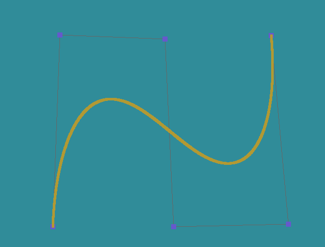

# Bezier Curve

## 鼠标控制

这次实验需要实现一个绘制 Bezier 曲线的小工具，因此第一步需要做的就是实现鼠标控制。

只需要使用`glfwSetMouseButtonCallback`和`glfwSetCursorPosCallback`设置鼠标点击回调事件和移动回调事件就可以获取到鼠标的点击事件和当前的位置。

```c++
void cursorPosCallback(GLFWwindow* window, double xpos, double ypos) {
  cursorX = xpos;
  cursorY = ypos;
}

void mouseButtonCallback(GLFWwindow* window, int button, int action, int mods) {
  buttonLeft = action == GLFW_PRESS && button == GLFW_MOUSE_BUTTON_LEFT;
  buttonRight = action == GLFW_PRESS && button == GLFW_MOUSE_BUTTON_RIGHT;
}
```

需要注意的是，获取到的鼠标位置是以左上角为原点建立的坐标系，我们还需要将其转换为标准坐标系或者使用正交投影使其映射到正确的位置。


## 绘制点

实现了鼠标控制之后，接下来就需要在屏幕上绘制用户点击的点，具体的方法之前实验已经做过很多次了，只需要使用`glDrawArrays`并且指定绘制类型即可轻松地在屏幕上绘制点。

```c++
// 画点
void BezierApp::drawPoint(int size, bool withLine, bool clear) {
  if (this->vCount < 1) return;
  // 顶点数组对象
  unsigned int VAO;
  glGenVertexArrays(1, &VAO);
  // 顶点缓冲对象
  unsigned int VBO;
  glGenBuffers(1, &VBO);
  // 绑定缓冲
  glBindVertexArray(VAO);
  glBindBuffer(GL_ARRAY_BUFFER, VBO);
  // 点的大小
  glPointSize(size);
  // 复制数据
  glBufferData(GL_ARRAY_BUFFER, sizeof(float) * this->vCount * 2, this->vPoint, GL_STATIC_DRAW);
  // 解析顶点数据
  glVertexAttribPointer(0, 2, GL_FLOAT, GL_FALSE, 0, (void*)0);
  glEnableVertexAttribArray(0);
  // 解除绑定
  glBindBuffer(GL_ARRAY_BUFFER, 0);
  glDrawArrays(GL_POINTS, 0, this->vCount);
  if (withLine) glDrawArrays(GL_LINE_STRIP, 0, this->vCount);
  glBindVertexArray(0);
  glDeleteVertexArrays(1, &VAO);
  glDeleteBuffers(1, &VBO);
  if (clear) this->vCount = 0;
}
```


## 绘制 Bezier 曲线

Bezier 曲线可以用以下公式表示：


其中 $B_{i,n}$ 为伯恩斯坦（Bernstein）基函数，其多项式可以表达为：


根据这两条公式，我们可以开始编写程序。

首先，计算 Bernstein 基函数需要多次用到阶乘，这里将每次阶层的结果记录下来，避免多次计算浪费资源。因为`int`类型最多可以存放12的阶乘，高于12的阶乘就会发生溢出。这里使用`long long int`可以最多算到21的阶乘，最多可以画出21个控制点的曲线。

```c++
// 计算阶乘
long long int BezierApp::getFactorial(int i) {
  if (i > 104) return 1;
  for (; computedFac <= i; computedFac++) {
    factorialTmp[computedFac] = factorialTmp[computedFac - 1] * computedFac;
  }
  return factorialTmp[i];
}
```

然后实现计算 Bernstein 基函数

```c++
// 计算 bernstein 函数
float BezierApp::bernstein(int i, int n, float t) {
  long long int a = getFactorial(i) * getFactorial(n - i);
  float res = getFactorial(n) / a;
  res *= pow(t, i) * pow(1 - t, n - i);
  return res;
}
```

最后将其画出来

```c++
// 画线
shader->SetVec3("drawColor", lineColor);
if (this->pointCount > 1) {
  for (float t = 0; t < 1; t += 0.001) {
    glm::vec2 p = this->point[0] * this->bernstein(0, this->pointCount - 1, t);
    for (int i = 1; i < this->pointCount; i++) {
      p = p + this->point[i] * this->bernstein(i, this->pointCount - 1, t);
    }
    this->addPoint(p);
  }
  this->drawPoint(5);
}
```




然后我们将其辅助线绘制出来，查看其具体的绘制过程。具体的做法是递归地将每一条线找出每一个时刻的中间点，然后链接起来直到最后一个条线。

```c++
// 辅助线
if (this->pointCount > 1) {
  shader->SetVec3("drawColor", glm::vec3(1, 1, 1));
  frameT += 0.01;
  if (frameT > 1) frameT = 0;
  float t = this->frameT;
  int mCount = this->pointCount;
  for (int i = 0; i < this->pointCount; i++) {
    mPoint[i] = point[i];
  }
  while (mCount > 1) {
    int newCount = 0;
    for (int i = 0; i < mCount - 1; i++) {
      glm::vec2 p = this->mPoint[i] * (1 - t) + this->mPoint[i + 1] * t;
      newPoint[newCount] = p;
      newCount++;
      this->addPoint(p);
    }
    this->drawPoint(5, true);
    for (int i = 0; i < newCount; i++) {
      mPoint[i] = newPoint[i];
    }
    mCount = newCount;
  }
  // 画点
}
```

然后就可以得到以下的结果：


可以画更多的控制点查看效果：


